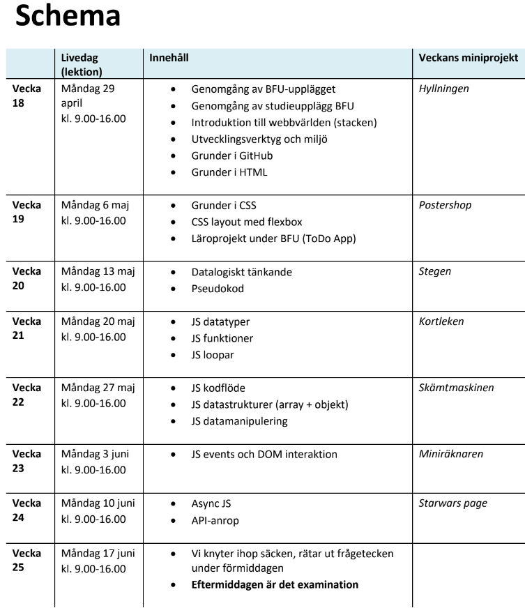

# 2024-06-10
Lektion vecka 6, asynkron JavaScript med API

## Material
+ [Övningar](exercises.md)
+ Presentation: [08 Asynkron JavaScript](https://docs.google.com/presentation/d/1d3wxjwRsrq7EXPsgkqCNV_neOKgoMEnUUdNB9fjg-0U/edit?usp=sharing)

Veckoprojekt
+ [Länk till projekt](projekt.md)
+ [Länk till inlämning](https://docs.google.com/forms/d/e/1FAIpQLSd1wjXFeMVtQyD4YzoeCyp5nXN68F8bQZ-9O-lazqzegsH7Iw/viewform?usp=sf_link)

Inspelning
+ [Länk till inspelning](https://folkuniversitetet-se.zoom.us/rec/share/ExnEjyUWGx-9v4wrYeAhijw9FYEBoynv02MRBcWEmaqLBbSZL4O43Ue23J483gQ.ziR4pXRrefCckysi)
+ Lösenkod: `0S4Jy1&N`

## Resurser

[API Directory](https://api-ninjas.com/api) | API Ninjas, sajt som samlar flera API

[The Modern JavaScript Tutorial](https://javascript.info/) - bra referens till JS

## Schema

