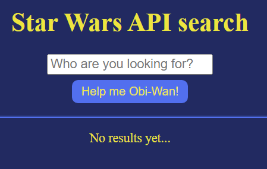

# Star Wars API
Du ska bygga en webbapp som hämtar information om karaktärer och planeter i Star Wars-universumet.

## Beskrivning
Sidan ska visa information om karaktärer från Star Wars. På varje nivå lägger vi till fler funktioner till sidan.

[Dokumentation för API:et](https://swapi.dev/documentation)



[Källkod till designskiss (CodePen)](https://codepen.io/david-zocom/pen/MWdEgaq?editors=1100)

### Level 1
Webbsidan ska ha en knapp med texten "Help me Obi-Wan". När användaren klickar på den, ska appen skicka ett request till:
```
https://swapi.dev/api/people/10/
```

Detta request kommer returnera data om Obi-Wan. Appen ska visa hans namn, höjd, vikt, hårfärg osv. (Bry dig inte om de egenskaper som innehåller länkar. Man kan använda dem för att skicka ett nytt request och få mer information.)

---
### Level 2
Sidan ska innehålla ett sökfält, där man kan skriva namnet på en person. Man klickar på en knapp för att skicka ett request till API:et, för att söka efter personer vars namn matchar.

Exempel: användaren skriver `Sky`.
Appen skickar ett request till:
```
https://swapi.dev/api/people/?search=Sky
```

Appen ska sedan presentera information om alla sökträffar, på samma sätt som på level 1.


### Level 3
Nu ska man kunna söka efter planeter också. Du kan återanvända sökfältet och sökknappen, eller göra nya.

---
### Level 4
När man läser informationen om en karaktär, ska man kunna se information om personens hemplanet också.

Tips 1: i stället för att ha all information i karaktärs-objektet (det skulle vara mindre effektivt) har de som skapat API:et valt att spara länkar i objekten. När du stöter på en URL, behöver du skicka ett nytt request till URL:en för att få datan. [Här kan du läsa om datastrukturerna i API:et.](https://swapi.dev/documentation#people)

```js
// du kan skriva funktioner som hämtar data
let person = getPersonFromApi()
let planet = getPlanetFromApi(person.homeworld)  // homeworld är en URL
```

---
### Level 5
Gör webbsidan "smart", så att den kommer ihåg tidigare sökningar.

---
### Level 6
Det skulle vara onödigt att hämta data flera gånger från API:et. Innan du skickar ett request, kan du kontrollera om URL:en finns med i en lista med tidigare request.
```js
const people = []
async function searchPeople(searchString) {
    // skicka request med fetch
    // när du har fått tillbaka data:
    for( let i=0;< i<data.results.length; i++ ) {
      const found = data.results[i]
      if( found finns i listan people ) {  // pseudokod
        people.push(found)
      }
    }
    return data.results
}
```

Tips: [funktionen `find` (MDN)](https://developer.mozilla.org/en-US/docs/Web/JavaScript/Reference/Global_Objects/Array/find) låter dig kontrollera om något redan finns i en lista.

---
### Level 7
Använd [localStorage (MDN)](https://developer.mozilla.org/en-US/docs/Web/API/Window/localStorage) för att spara datan, så att användaren kan komma åt tidigare sökningar även om man laddar om sidan.

---

### Finns det något man inte ska använda i uppgiften?
Ja! Undvik:

+ att skriva `<button onclick=` inuti din HTML. HTML ska vara i sin fil, CSS i sin fil, och JavaScript i sina filer. Blanda inte!

+ funktionen `alert()` som visar ett popup-meddelande. Använd istället antingen console.log eller HTML-element och innerText för att visa meddelanden.

+ att lägga `<script>` sist i `<body>`. Script-taggen hör hemma inuti `<head>`.

+ att använda `window.location.reload()`, den laddar om hela webbsidan. Det är best practice att återställa JavaScript-variablerna till sina initiala värden.


---

## Inlämning
Din inlämning ska vara något av följande:
+ en länk till din [replit](https://replit.com/)
+ en länk till ditt GitHub repository (kom ihåg: public)

[Länk till inlämningen finns på README-sidan.](README.md)
